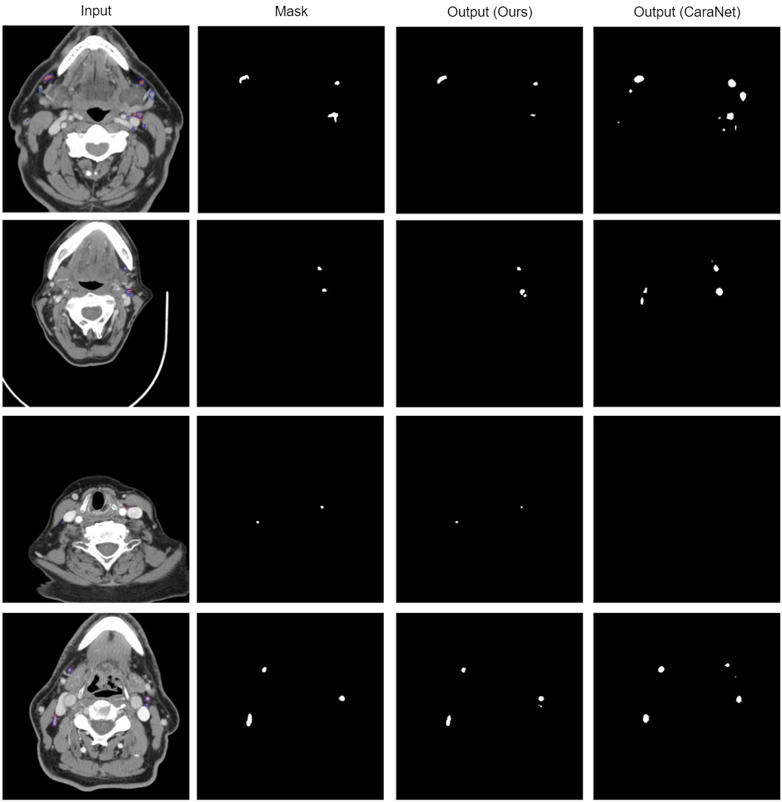

### [Automated Segmentation of Lymph Nodes on Neck CT Scans Using Deep Learning](https://link.springer.com/article/10.1007/s10278-024-01114-w)
Official Pytorch implementation of S-Net, from the following paper:
[Automated Segmentation of Lymph Nodes on Neck CT Scans Using Deep Learning](https://link.springer.com/article/10.1007/s10278-024-01114-w). Journal of Imaging Informatics in Medicine 2023 (Accepted) \

---

<p align="center">

</p>

<p align="center">

</p>

<p align="center">

</p>

<!-- 

    ```
    git clone https://github.com/mahfuzalhasan/spatial-context-network.git
    ```
2. Run *python3 main.py* to check the model loading.
3. Torch version 1.12.1 is used with CUDA 10.2. But latest version should work just fine.  -->