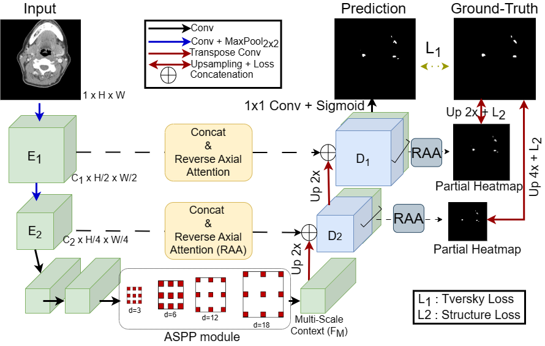
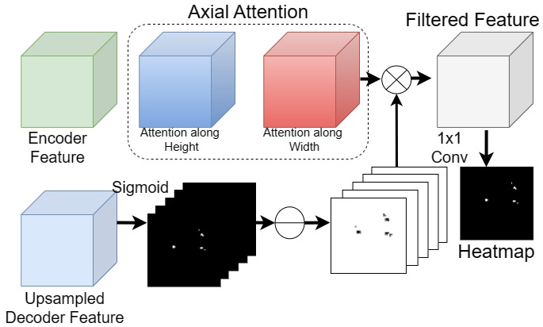

### [Automated Segmentation of Lymph Nodes on Neck CT Scans Using Deep Learning](https://link.springer.com/article/10.1007/s10278-024-01114-w)
Official Pytorch implementation of S-Net, from the following paper:
[Automated Segmentation of Lymph Nodes on Neck CT Scans Using Deep Learning](https://link.springer.com/article/10.1007/s10278-024-01114-w). Journal of Imaging Informatics in Medicine 2023 (Accepted)

---

<p align="center">

</p>

<p align="center">

</p>

We propose **Spatial Context Network (S-Net)**, a dilated convolution-based network to capture multi-scale context from head and neck CT for small lymph node (LN) segmentation. The network downsamples feature space only twice in encoding stage to preserve the spatial context from small LN. On the other hand, to address the limited receptive field, the network utilizes Atrous Spatial Pyramid Pooling (ASPP) to focus on multi-scale feature. As skip connection, the network utilizes reverse axial attention module to filter out unnecessary component detection outside of LN in order to reduce False Positive (FP). The network is supervised by binary tversky loss and weighted iou (termed as structure loss --> Ref:[PraNet](https://arxiv.org/abs/2006.11392)) to address the per-sample class-imbalance problem.

## Libraries
Torch version 1.12.1 is used with CUDA 10.2. But latest version should work just fine.

## Data Processing
Run *process_data/data_process_lymph_node.py* to save slice-wise data. We used window_center=40 and window_width=400 for each slice windowing and saved the data in both 8-bit jpg and 16-bit npz format. 

## Split Creation
Run *process_data/data_parser.py* to create five validation fold. For each fold and split, we tracked both positive (lymph_node.pkl) and negatve slices (no_lymph_node.pkl). As small lymph node doesn't occupy much space depth-wise, we used equal sampling of positive and negative slices during training of each epoch.

## Config
Please look into *config.py* carefully to set necessary parameters for the training and evaluation

## Training
Run *train_segmentation.py*. On config file, set *val_fold* to select which fold to train on. Please look into other variables in *config.py*.

## Evaluation
Run *test_segmentation.py*. Set best model path in *config.py*.

## Citation
If you find this repository helpful, please consider citing:
```
@article{al2024automated,
  title={Automated Segmentation of Lymph Nodes on Neck CT Scans Using Deep Learning},
  author={Al Hasan, Md Mahfuz and Ghazimoghadam, Saba and Tunlayadechanont, Padcha and Mostafiz, Mohammed Tahsin and Gupta, Manas and Roy, Antika and Peters, Keith and Hochhegger, Bruno and Mancuso, Anthony and Asadizanjani, Navid and others},
  journal={Journal of Imaging Informatics in Medicine},
  volume={37},
  number={6},
  pages={2955--2966},
  year={2024},
  publisher={Springer}
}
```